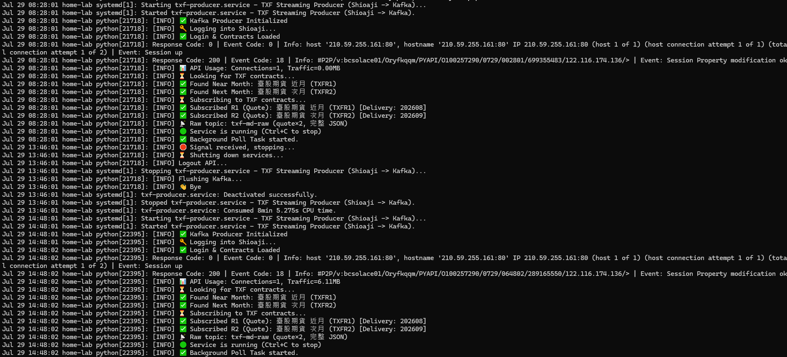

# txf-streaming-server — 台指期即時行情 producer

**Shioaji → Protobuf → Kafka**。以 Asyncio 連永豐 Shioaji API,把近月(TXFR1)/ 次月(TXFR2)
台指期的 **Tick** 與 **BidAsk** 序列化後即時推進 Kafka,供下游看盤 / 戰情室消費。

```
永豐 Shioaji API
   ├─（即時）→ 【本專案】txf-streaming-server ─Protobuf→ Kafka ──┐
   └─（歷史）→ txf-data-lake ─────Polars─────→ Parquet ─────────┤
                                          (D:\txf-data)        ├─→ txf-quant-platform（看盤/回測）
                                                               └─→ txf-gale-engine（戰情室看板）
```

**Kafka 的消費者是 quant-platform 與 gale-engine**;`txf-data-lake` 走 Shioaji 歷史 API,不碰 Kafka。

| | |
|---|---|
| **執行** | `python -m src.txf_producer`(必須是模組形式) |
| **需求** | Python 3.13(`.python-version` 鎖定)、shioaji ≥ 1.7、一個 Kafka broker |
| **部署** | Ubuntu + systemd + crontab,見 [第 3 節](#3-部署) |

---

## 1. 要部署一整套?照這個順序

| 順序 | 做什麼 | 看哪份文件 | 需要 Kafka? |
|---|---|---|---|
| 1️⃣ | **架 Kafka broker**(空白機器從零) | [`deploy/kafka/SETUP.md`](deploy/kafka/SETUP.md) | — |
| 2️⃣ | **部署本專案**(producer,行情進 Kafka) | 本文件第 2、3 節 | ✅ |
| 3️⃣ | 建歷史資料湖(**可與 1️⃣2️⃣ 平行做,不需 Kafka**) | `txf-data-lake` README | ❌ |
| 4️⃣ | 消費端:看盤 / 回測 / 策略 | `txf-quant-platform` README | 只有即時看盤要 |
| 5️⃣ | 消費端:當沖戰情室看板 | `txf-gale-engine` README | 只有 live 模式要 |

- 目標機器**已經有 Kafka** 就跳過 1️⃣。
- 4️⃣5️⃣ **兩個消費端都需要 3️⃣ 的 Parquet 資料湖**(回測、日線、prev-close 都靠它),
  只有「即時跳動」那部分才走 Kafka。**先把資料湖建起來,兩個看盤器就能離線用了。**
- 四個 repo 都用 **Python 3.13 + uv**,依賴各自獨立(每個 repo 自己的 `.venv`)。

---

## 2. 安裝與設定

```bash
git clone https://github.com/gman-quant/txf-streaming-server.git
cd txf-streaming-server

uv python install 3.13              # 取得 .python-version 鎖定的 Python
uv venv                             # 建 .venv
uv pip install -r requirements.txt

cp .env.example .env && vi .env     # 填金鑰與 Kafka 位址(見下)
python -m src.txf_producer
```

### `.env`

```bash
SHIOAJI_API_KEY=...
SHIOAJI_SECRET_KEY=...
KAFKA_BOOTSTRAP_SERVERS=broker_ip:9092
TICK_TOPIC=txf-tick          # 三個 topic 都必填 ——
TICK_R2_TOPIC=txfr2-tick     #   缺 TICK_R2_TOPIC 會讓每筆 R2 tick 發送失敗
BIDASK_TOPIC=txf-bidask
```

> `.env` 含金鑰,已被 gitignore。**broker 位址是 per-machine 的,不要 commit。**

### 驗證裝好了沒(不必等開盤)

```bash
python -m src.tools.verify_pipeline    # 合成報價跑完整條鏈,只寫測試 topic
python -m src.tools.txf_consumer       # 即時解碼行情、量測延遲(需有行情)
```

`verify_pipeline` 會驗:shioaji 模型欄位、protobuf 序列化、Kafka 投遞、R2 路由、
simtrade 過濾、位元組解得回原值。它**斷言測試 topic 與生產 topic 無交集**,有交集直接拒跑。

---

## 3. 部署

Ubuntu systemd 背景服務 + crontab 隨 TAIFEX 時段自動啟停。
unit 檔已含實測調校(CPU 綁核、OOM 保護、`SIGINT` graceful stop)。

```bash
sudo useradd -r -m -d /home/shioaji_svc shioaji_svc
sudo cp deploy/txf-producer.service /etc/systemd/system/
sudo systemctl daemon-reload && sudo systemctl start txf-producer
journalctl -u txf-producer -f
```

要看到:`Login OK` → `Found Near/Next Month` → `Subscribed R1/R2` → `Service is running`。

> ⚠️ **換機器必改 `deploy/txf-producer.service` 兩處:**
> - **`CPUAffinity`** —— 要綁「同一顆實體核的兩個 HT 兄弟」,用
>   `cat /sys/devices/system/cpu/cpu<N>/topology/thread_siblings_list` 查。
>   只綁一個 = 另一個兄弟核的工作仍會來搶。(現值 `2 6` 是 i7-4770 的答案,別照抄到別台機器。)
> - **`WorkingDirectory` / `ExecStart`** 路徑。

### 交易時段排程(crontab)

`systemctl enable` 是**不需要的** —— 啟停由 crontab 控制,不靠開機自啟。

```cron
40 08 * * 1-5 /bin/systemctl start txf-producer.service   # 日盤 08:45
46 13 * * 1-5 /bin/systemctl stop  txf-producer.service   # 日盤收 13:45
55 14 * * 1-5 /bin/systemctl start txf-producer.service   # 夜盤 15:00
01 05 * * 2-6 /bin/systemctl stop  txf-producer.service   # 夜盤收 05:00
```

### 🔴 重啟的代價不對稱

- `daemon-reload` → **零影響**,隨時可做
- `restart` → 斷線幾秒,而且:
  - **tick** 隔天可從 Shioaji 歷史 API 補回
  - **bidask 只存在 Kafka,Shioaji 沒有歷史 API —— 斷幾秒就永久少幾秒**

**→ 改設定隨時可做,重啟一律等收盤**(週六 05:00 後,或平日 13:45–15:00 盤間)。

### 健康檢查

systemd 只知道行程在不在,測不到「連得上但不再送 tick」(斷線重連失敗、訂閱掉了、
回調在吞例外)。`deploy/check_feed_alive.sh` 檢查 topic offset 在交易時段內是否前進
(掛法見腳本尾端)。**建議先只告警、觀察數日再開自動重啟** —— 誤判重啟會製造 bidask 破洞。

---

## 4. 資料格式(wire schema)

Protobuf 3;價格一律 **Scaled Integer(實際價 × 10000)**,還原時 ÷10000。
`protos/txf_data.proto` 是**跨 repo 共用的契約**,改動會波及所有下游消費者。

### Tick (`txf.Tick`)
| Field | Type | 說明 |
| :--- | :--- | :--- |
| `code` | string | 商品代碼(如 `TXFH6`) |
| `timestamp_ms` | int64 | Unix Epoch (ms) |
| `close` | int64 | 成交價 ×10000 |
| `volume` | int32 | 單筆量 |
| `tick_type` | int32 | 1:外盤 / 2:內盤 |
| `total_volume` | int32 | 當日總量(可用來偵測封包遺漏) |
| `underlying_price` | int64 | 標的價 ×10000 |

### BidAsk (`txf.BidAsk`)
| Field | Type | 說明 |
| :--- | :--- | :--- |
| `bid/ask_total_vol` | int32 | 委託總量 |
| `bid/ask_price` | repeated int64 | 五檔價 ×10000 |
| `bid/ask_volume` | repeated int32 | 五檔量 |
| `diff_..._vol` | repeated int32 | 五檔掛單變化量 |

**Topic 路由**:TXFR1 tick → `txf-tick`、TXFR2 tick → `txfr2-tick`(R2 無 BidAsk)、
TXFR1 BidAsk → `txf-bidask`。

> R2 的 `quote.code` 是**真實月份碼**(如 `TXFI6`)不是 `"TXFR2"`,路由要同時比對
> `target_code` —— 這是修過的 bug,別退回。

### 改了 `.proto` 之後

```bash
python -m grpc_tools.protoc -I protos --python_out=src protos/txf_data.proto
```

---

## 5. 規模與資源需求

實測值(2026-07,涵蓋 2025-12 起 190 個交易日):

| | |
|---|---|
| 訊息量 | 日均 **41 萬則**,最忙一天 79 萬則 |
| 峰值 | **353 則/秒**(p99 僅 50/秒) |
| 組成 | **BidAsk 佔 86%**、Tick 14%、R2 <1% |
| 磁碟 | BidAsk 約 **52 MB/天** ≈ 19 GB/年;Tick 寬鬆得多 |
| CPU | **< 1% 的一顆核心**(i7-4770 實測) |
| 成長 | 8 個月 +72% |

**給部署者的三個結論:**

1. **CPU 不是問題**,一般機器綽綽有餘;真正要規劃的是**磁碟與 Kafka 保留期**。
2. **算容量要用合計值,別只算 Tick** —— BidAsk 是 Tick 的六倍,只算 Tick 會低估八倍。
   保留期設定見 [`deploy/kafka/SETUP.md`](deploy/kafka/SETUP.md) 第 5 節。
3. **量增長很快**(8 個月 +72%),`retention.bytes` 要留餘裕 —— 大小上限先到會**靜默**砍掉
   還沒滿一年的資料。

### 想在自己機器上重量

```bash
python -m src.tools.measure_load scan                      # 全史負載(零消費,幾十秒)
python -m src.tools.measure_load profile --date <YYYY-MM-DD>   # 峰值與延遲分布
python -m src.tools.measure_load verify  --date <YYYY-MM-DD>   # 與資料湖對帳,驗有無遺漏
python -m src.tools.measure_load stalls  --start-date <D> --end-date <D>   # 找供料中斷
```

CPU 餘裕不必另外測,systemd 每次收工都會記:`journalctl -u txf-producer | grep Consumed`。

> 量測方法的細節與坑(滑動 vs 固定視窗、produce vs 交易所時間軸、已判死的遺漏偵測法)
> 寫在 `src/tools/measure_load.py` 的檔頭與 `CLAUDE.md`,部署不需要讀。



---

## Disclaimer

本專案供程式交易研究與教育用途。API 連線不穩、報價延遲或系統故障皆可能造成損失,
使用者需自行承擔。
